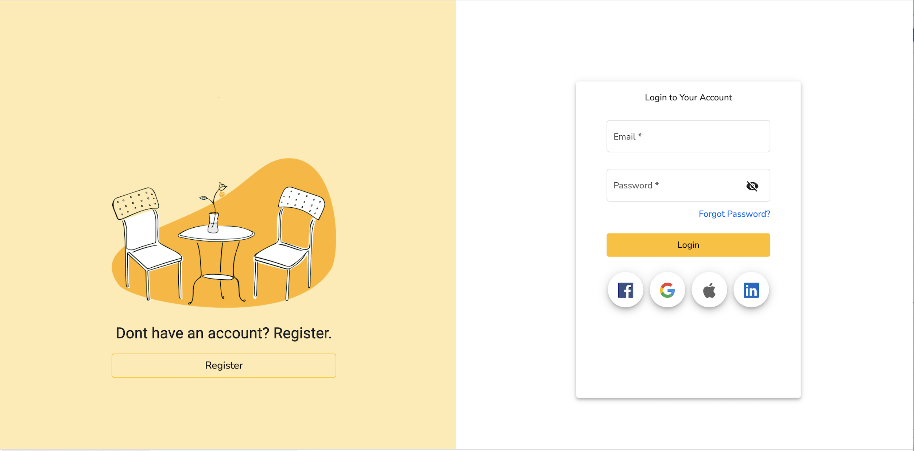
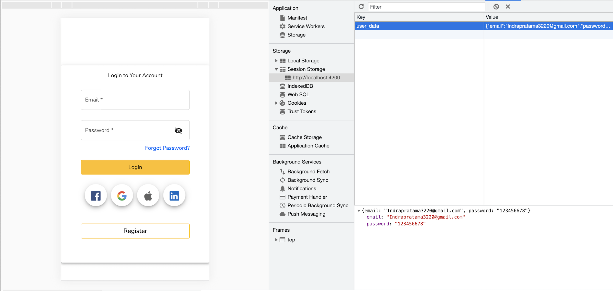

# Challenge Angular

# Description

This gold-pocket that can store your wealth into a gold or something else. Here is some preview of the application.

## Login Page

## Result in Session Storage

# Table of Contents 

* [Installation](#installation)

* [Usage](#usage)

* [License](#license)

* [Contributing](#contributing)

* [Questions](#questions)

## Installation

This project was generated with [Angular CLI](https://github.com/angular/angular-cli) version 12.0.2.

#### Development server

Run `ng serve` for a dev server. Navigate to `http://localhost:4200/`. The app will automatically reload if you change any of the source files.

#### Code scaffolding

Run `ng generate component component-name` to generate a new component. You can also use `ng generate directive|pipe|service|class|guard|interface|enum|module`.

#### Build

Run `ng build` to build the project. The build artifacts will be stored in the `dist/` directory.

## Usage

#### Running unit tests

Run `ng test` to execute the unit tests via [Karma](https://karma-runner.github.io).

#### Running end-to-end tests

Run `ng e2e` to execute the end-to-end tests via a platform of your choice. To use this command, you need to first add a package that implements end-to-end testing capabilities.

#### Further help

To get more help on the Angular CLI use `ng help` or go check out the [Angular CLI Overview and Command Reference](https://angular.io/cli) page.

The following necessary dependencies must be installed to run the application properly: Cocoapods, Moya, Netfox, Kingfisher, OTPFieldView, NVAActivity

## License

This project is license under the MIT license.

## Contributing

​Contributors: Indra Anugrah Pratama

## Questions

If you have any questions about the repo, open an issue or contact IndraPratama98 directly indra.pratama3224@gmail.com

